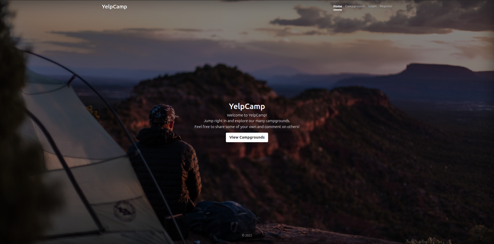
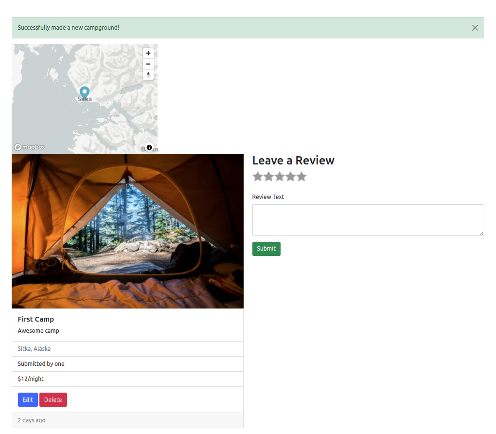
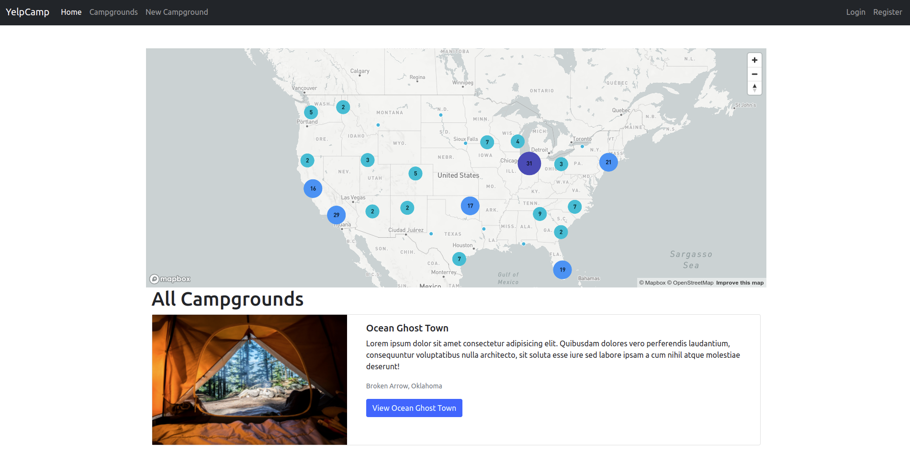

# YelpCampApp
> The application allows registered users to add new campgrounds and review them.
<!-- > Live demo [_here_](https://www.example.com). If you have the project hosted somewhere, include the link here. -->

## Table of Contents
* [General Info](#general-information)
* [Technologies Used](#technologies-used)
* [Features](#features)
* [Screenshots](#screenshots)
* [Setup](#setup)
* [Usage](#usage)
* [Project Status](#project-status)
* [Room for Improvement](#room-for-improvement)
* [Acknowledgements](#acknowledgements)
* [Contact](#contact)
<!-- * [License](#license) -->


## General Information
- Project was part of The Web Developer Bootcamp 2022
- The main purpose of the project was to learn both front-end and back-end development with JavaScript


## Technologies Used
- HTML5
- CSS3
- Bootstrap 5
- NodeJS
- ExpressJS
- MongoDB


## Features
List the ready features here:
- Campground CRUD
- Reviews CRUD
- User Authentication
- Image Upload 
- Maps and Geocoding


## Screenshots



<!-- If you have screenshots you'd like to share, include them here. -->


## Setup
Download code and run
```console
npm install
```

## Usage
To start application run 
```console
node app.js
```

## Project Status
Project is: _in progress_ 


## Room for Improvement

Room for improvement:
- Better UI

To do:
- Helemt for security
- Live demo on Heroku
 

## Acknowledgements
Give credit here.
- This project was based on [The Web Developer Bootcamp 2022](https://www.udemy.com/course/the-web-developer-bootcamp/).


## Contact
Created by Karol Kijowski - feel free to contact me!


<!-- Optional -->
<!-- ## License -->
<!-- This project is open source and available under the [... License](). -->

<!-- You don't have to include all sections - just the one's relevant to your project -->
